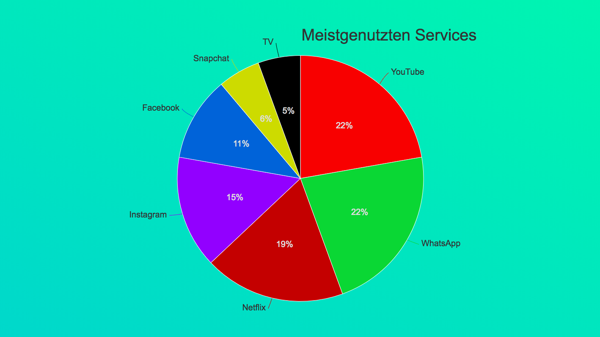
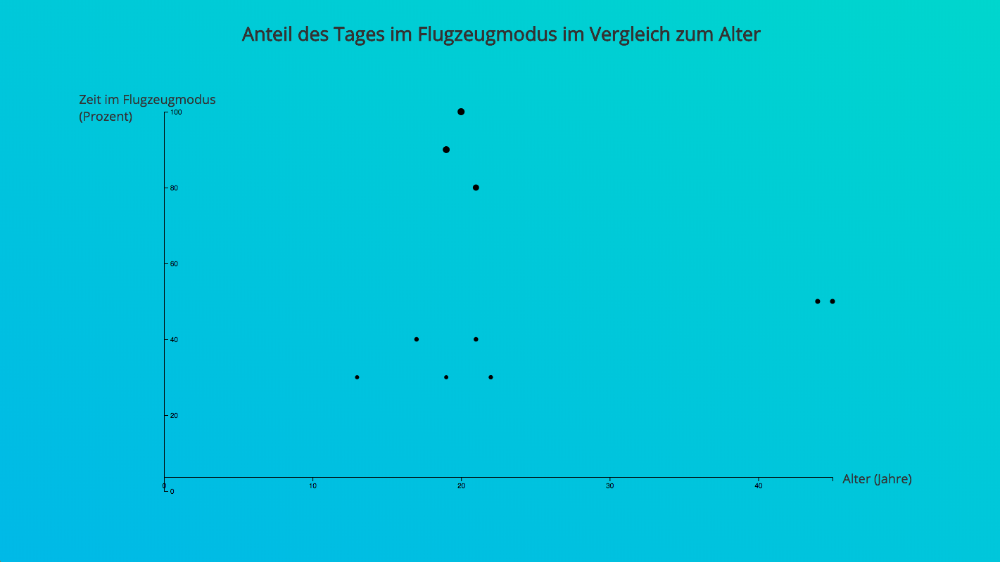
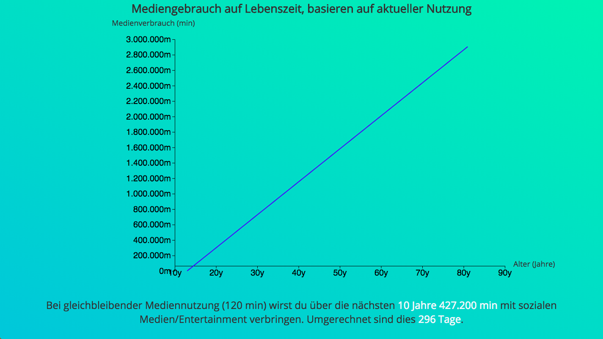
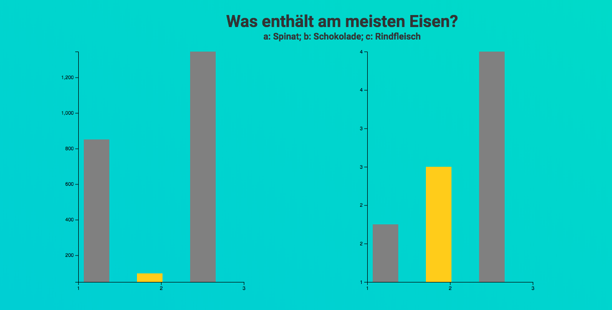
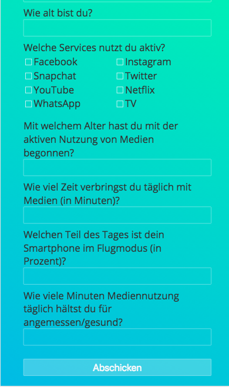

# disconnected

> Site for school project, a theatrical installaction on modern media

Site for school project, a theatrical installaction on modern media, that generates data visualizations based on the participants input. Built using node, express, mongoose and d3.

## License

MIT © [Jonathan Neidel](https://jneidel.com)
